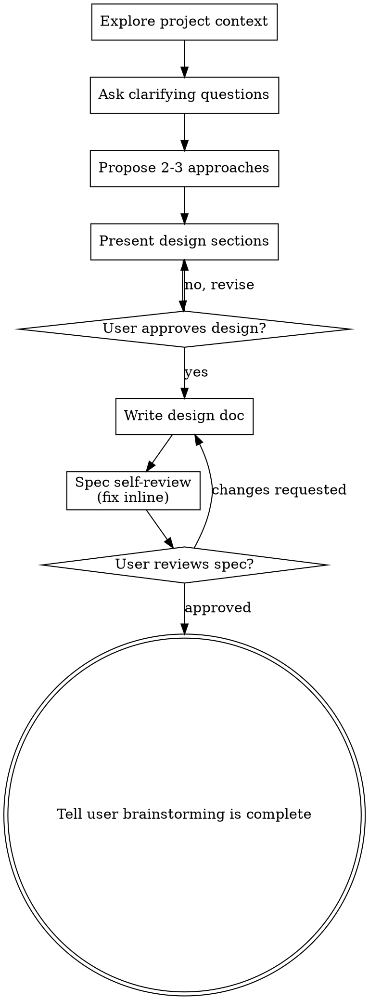

# 通过头脑风暴把想法变成设计

通过自然的协作对话，帮助把想法变成完整成型的设计和规格说明。

先了解当前项目的上下文，然后一次只问一个问题来细化想法。一旦你清楚了要构建什么，就呈现设计并获得用户批准。

<HARD-GATE>
在你呈现设计并获得用户批准之前，不要调用任何实现类 skill、不要编写任何代码、不要搭建任何项目脚手架、不要采取任何实现行动。无论项目看起来多么简单，这条规则都适用。
</HARD-GATE>

## 反模式："这太简单了，不需要设计"

每个项目都要走这个流程。待办清单、单函数工具、配置改动——全都一样。"简单"项目恰恰是未经审视的假设最容易造成返工浪费的地方。设计可以很短（对真正简单的项目，几句话即可），但你必须呈现它并获得批准。

## 检查清单

你必须为以下每一项创建任务，并按顺序完成：

1. **探索项目上下文** —— 查看文件、文档、近期提交
2. **在恰当时机提供视觉伴侣** —— 而不是一开始就提供。当某个问题第一次出现"画出来比说出来更清楚"的情形时，在那时提出（单独一条消息）；用户同意后，它的浏览器标签页会为你打开。如果始终没出现适合可视化的问题，就永远不要主动提供。见下方"视觉伴侣"一节。
3. **提出澄清问题** —— 一次一个，理解目的/约束/成功标准
4. **提出 2-3 种方案** —— 附带取舍分析和你的推荐
5. **呈现设计** —— 按复杂度划分小节，每节之后获得用户确认
6. **编写设计文档** —— 保存到 `docs/specs/YYYY-MM-DD-<topic>-design.md` 并提交
7. **规格自审** —— 快速内联检查占位符、矛盾、歧义、范围（见下文）
8. **用户审查写好的规格** —— 在继续之前请用户审查规格文件
9. **收尾头脑风暴流程** —— 告诉用户头脑风暴流程已完成，下一步由他们决定

## 流程图

**终态是告诉用户头脑风暴流程已完成。**不要在头脑风暴之后自动调用 frontend-design、mcp-builder、writing-plans 或任何其他实现类 skill。

## 具体流程

**理解想法：**

- 先查看当前项目状态（文件、文档、近期提交）
- 在问细节问题之前，先评估范围：如果请求描述的是多个相互独立的子系统（例如"构建一个包含聊天、文件存储、计费和分析的平台"），立即指出这一点。不要为一个首先需要拆分的项目浪费问题去细化细节。
- 如果项目对单个规格来说太大，帮助用户将其拆分为子项目：独立的部分有哪些、它们之间如何关联、应该按什么顺序构建？然后按正常设计流程对第一个子项目进行头脑风暴。每个子项目都有自己的规格和后续交付周期。
- 对于范围合适的项目，一次问一个问题来细化想法
- 尽可能优先使用选择题，开放式问题也可以
- 每条消息只问一个问题——如果一个话题需要更多探索，拆成多个问题
- 聚焦于理解：目的、约束、成功标准

**探索方案：**

- 提出 2-3 种不同方案，附带取舍分析
- 以对话方式呈现选项，给出你的推荐和理由
- 先讲你推荐的方案并解释原因

**呈现设计：**

- 当你认为已经理解要构建什么之后，呈现设计
- 每个小节的篇幅随复杂度伸缩：直截了当的几句话即可，微妙复杂的最多 200-300 词
- 每个小节后询问目前看起来是否正确
- 覆盖：架构、组件、数据流、错误处理、测试
- 如果哪里说不通，准备好回头澄清

**为隔离性和清晰度而设计：**

- 把系统拆成更小的单元，每个单元有一个明确的用途，通过定义良好的接口通信，可以独立地被理解和测试
- 对每个单元，你都应该能回答：它做什么、怎么使用它、它依赖什么？
- 不看某个单元的内部实现，能否理解它做什么？能否改变其内部实现而不破坏调用方？如果做不到，边界就需要调整。
- 更小、边界清晰的单元也更容易让你自己开展工作——你能更好地推理那些可以一次性放入上下文中的代码，当文件职责单一时你的编辑也更可靠。当一个文件变得很大时，这往往说明它承担得太多了。

**在现有代码库中工作：**

- 在提出改动之前先探索现有结构。遵循既有模式。
- 当现有代码存在影响本次工作的问题时（例如某个文件长得太大、边界不清、职责纠缠），把有针对性的改进作为设计的一部分——就像一个优秀开发者改进他正在处理的代码那样。
- 不要提出无关的重构。专注于服务于当前目标的内容。

## 设计之后

**文档化：**

- 把经过验证的设计（规格）写入 `docs/specs/YYYY-MM-DD-<topic>-design.md`
  - （用户对规格存放位置的偏好优先于此默认值）
- 如果可用，使用 elements-of-style:writing-clearly-and-concisely skill
- 将设计文档提交到 git

**规格自审：**
写完规格文档后，以新鲜的眼光审视它：

1. **占位符扫描：** 有没有 "TBD"、"TODO"、未完成的段落或含糊的需求？修掉它们。
2. **内部一致性：** 各节之间有没有相互矛盾？架构是否与功能描述匹配？
3. **范围检查：** 内容是否足够聚焦，适合一次后续实现，还是需要拆分？
4. **歧义检查：** 有没有哪条需求可能有两种不同的解读？如果有，选定一种并写明确。

内联修复所有问题。不需要再走一遍审查——修完就继续。

**用户审查关口：**
规格审查循环通过后，在继续之前请用户审查写好的规格：

> "规格已写好并提交到 `<path>`。请审查，并告诉我在收尾头脑风暴流程之前是否要做任何修改。"

等待用户回复。如果他们要求修改，修改后重新走规格审查循环。只有在用户批准后才继续。

用户批准后，用类似下面的消息收尾流程：

> "头脑风暴完成。设计/规格已就绪，你随时可以决定下一步。"

**批准之后：**

- 告诉用户头脑风暴流程已完成
- 不要自动调用任何其他 skill 或实现工作流

## 关键原则

- **一次一个问题** —— 不要用多个问题压垮用户
- **优先选择题** —— 可能比开放式问题更容易回答时就用选择题
- **严格执行 YAGNI** —— 从所有设计中删掉不必要的功能
- **探索备选方案** —— 定案前总是提出 2-3 种方案
- **增量式验证** —— 呈现设计，获批后再前进
- **保持灵活** —— 说不通时回头澄清

## 视觉伴侣

一个基于浏览器的伴侣工具，用于在头脑风暴期间展示模型稿（mockup）、图表和可视化选项。它是一种工具——而不是一种模式。接受伴侣工具意味着它在适合可视化的问题出现时可用；并不意味着每个问题都要走浏览器。

**提供伴侣工具（恰当时机）：** 不要一开始就提供。等到某个问题确实"画出来比说出来更清楚"时——是真正的模型稿 / 布局 / 图表问题，而不仅仅是 UI *话题*。第一次出现这种情况时，在那时提出，单独一条消息：
> "下一部分如果我直接展示给你看可能更容易——我可以在浏览器标签页里随时搭出模型稿、图表和对比。它还很新，token 消耗可能比较大。要我用吗？我会为你打开它。"

**这个提议必须是单独一条消息。** 只发提议——不带澄清问题、总结或其他内容。等待用户回复。如果他们接受，用 `--open` 启动服务器，让他们的浏览器自动打开到第一个屏幕。如果他们拒绝，继续纯文本方式，并且除非他们主动提起，不再提议。

**逐问题决策：** 即使用户已接受，也要对每个问题决定用浏览器还是终端。判断标准是：**这个问题用户看到它是否比读到它更容易理解？**

- **用浏览器** 处理本身就是视觉的内容——模型稿、线框图、布局对比、架构图、并排的可视化设计
- **用终端** 处理文本类内容——需求问题、概念性选择、取舍清单、A/B/C/D 文本选项、范围决策

关于 UI 话题的问题不自动等于视觉问题。"这个语境下 personality 是什么意思？"是概念性问题——用终端。"哪种向导页布局更合适？"是视觉问题——用浏览器。

如果他们同意使用伴侣工具，在继续之前阅读详细指南：
`visual-companion.md`
